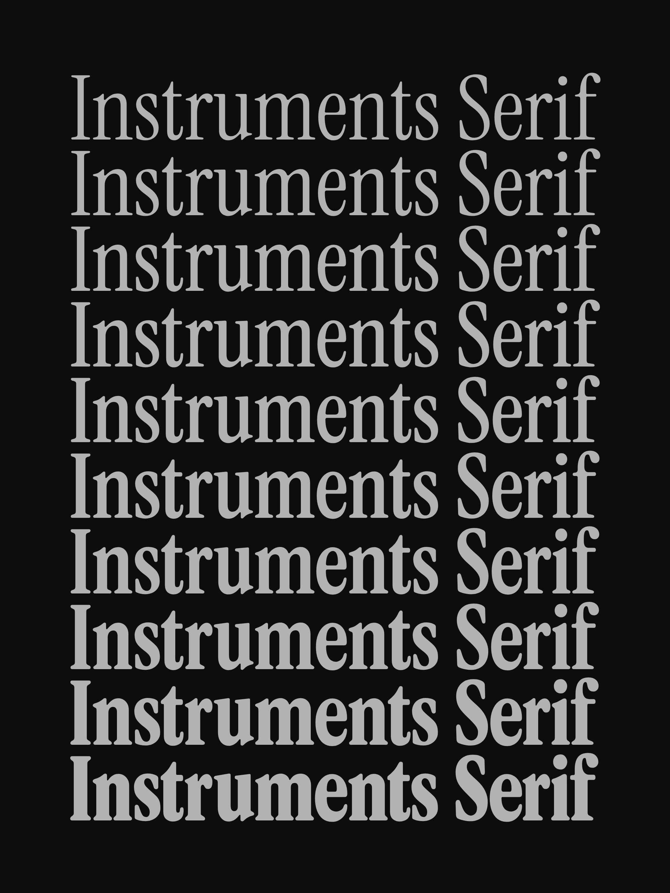

# Instruments Serif



A variable weight serif typeface forked from [Instrument Serif](https://github.com/Instrument/instrument-serif), with a weight axis ranging from Regular (400) to Black (900).

## Language support

The 374 latin glyphs that make up this font support 86 languages:

Afrikaans, Albanian, Asu, Basque, Bemba, Bena, Breton, Catalan, Chiga, Colognian, Cornish, Croatian, Czech, Danish, Dutch, English, Estonian, Faroese, Filipino, Finnish, French, Friulian, Galician, Ganda, German, Gusii, Hungarian, Inari Sami, Indonesian, Irish, Italian, Jola-Fonyi, Kabuverdianu, Kalenjin, Kinyarwanda, Latvian, Lithuanian, Lower Sorbian, Luo, Luxembourgish, Luyia, Machame, Makhuwa-Meetto, Makonde, Malagasy, Maltese, Manx, Morisyen, North Ndebele, Norwegian Bokmål, Norwegian Nynorsk, Nyankole, Oromo, Polish, Portuguese, Quechua, Romanian, Romansh, Rombo, Rundi, Rwa, Samburu, Sango, Sangu, Scottish Gaelic, Sena, Serbian, Shambala, Shona, Slovak, Soga, Somali, Spanish, Swahili, Swedish, Swiss German, Taita, Teso, Turkish, Upper Sorbian, Uzbek (Latin), Volapük, Vunjo, Welsh, Western Frisian, Zulu

## Building

```bash
# Build the variable font with fontc
./build.sh
```

## Acknowledgements

Originally designed by [Rodrigo Fuenzalida](https://rfuenzalida.com) with direction from [Jordan Egstad](https://egstad.com), [JD Hooge](http://jdhooge.com/), and [Jack De Caluwé](https://jackdecaluwe.com/) on behalf of [Instrument](https://instrument.com).

## License

This Font Software is licensed under the SIL Open Font License, Version 1.1. This license is available with a FAQ at: https://scripts.sil.org/OFL
